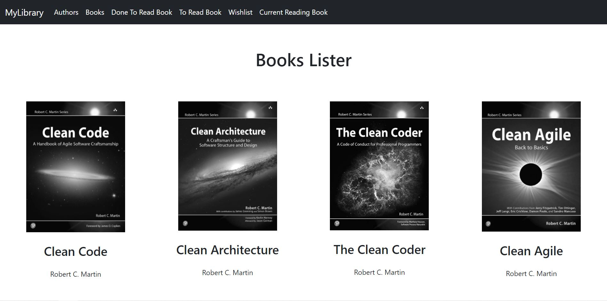
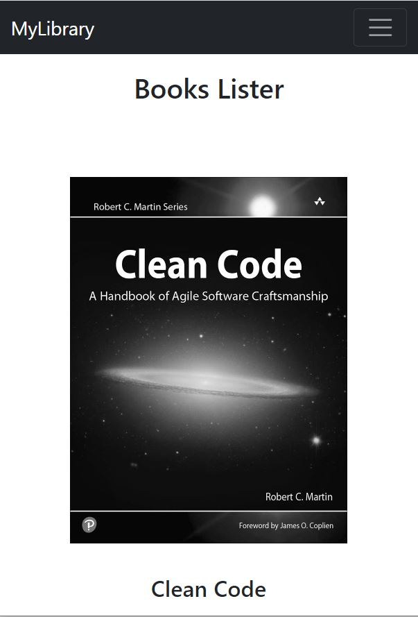
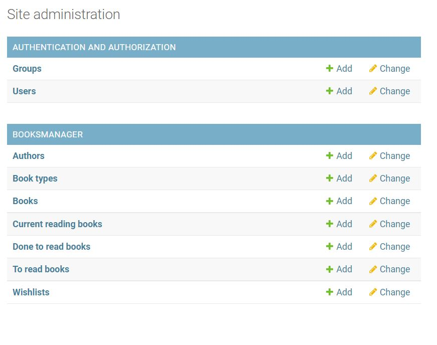
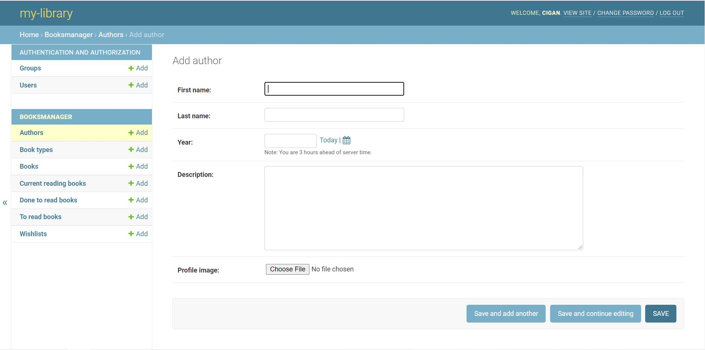
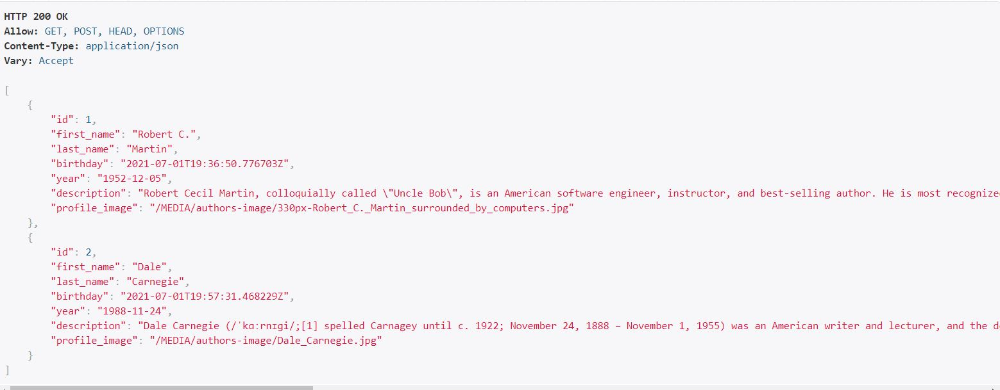
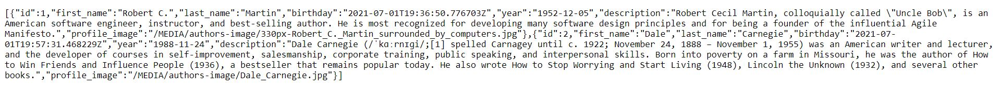
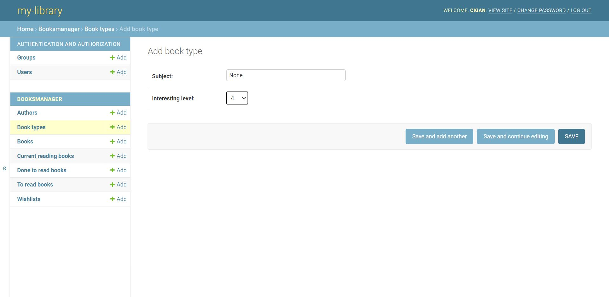

# MyLibrary

MyLibrary is a backend system which takes care of all the books you have and want to read. This app ass I said is 
more like a backend system related with a restapi (the django rest framework api) where the design UI/UX is not that
important. From here the simplistic design: 

Even tough the design considerations are not that important in this case, I still believe
the app should possess a responsive design, so I implemented the app in that manner.

## Backend

In the backend I have 7 models, each of them being strongly related to one another.

* Authors -> which includes all the authors from the library
* Book Types -> which includes all types of books that the library possess
* Books -> which includes the actual books from the library
* Current reading books -> which includes the books that you're currently reading
* Done to read books -> which includes the books that you already read.
* To read books -> which includes the books that you need to read
* Wishlist -> which includes the books that you want in your library

The models can be seen below

##### Authors

The authors table represents a simple registration of all the authors from the library. In this way, 
the reader can  be aware of the most preferred authors, or what every author has written. 
From the administration system you can actualise, change or add new authors very easy through 
a basic form.

This table is linked to other models like Books, CurrentReadingBooks, DoneToReadBooks etc. by a foreign key.
Each book has an author, and the author must me registered in the system. 

Like every table from this system, this one is integrated along the django rest api framework.

The data can be accessed in raw json format as well.

##### BookTypes

This table consists in information about books types. It is directly linked by a foreign key with all the tables
from this database in one way or another, except the Authors table. Having such a table is extremely important 
because in this way you as a reader can categorize and filter books with much more ease, not only by the author.

From the administration system you can actualise, change or add new types of books very easy through 
a basic form.

Note the interesting level field. With that one, you can adjust your interests so that you can get relevant books
recommendations or just categorize your books by the interesting level.

##### Books

##### CurrentReadingBooks

##### DoneToReadBooks

##### ToReadBooks

##### Wishlist